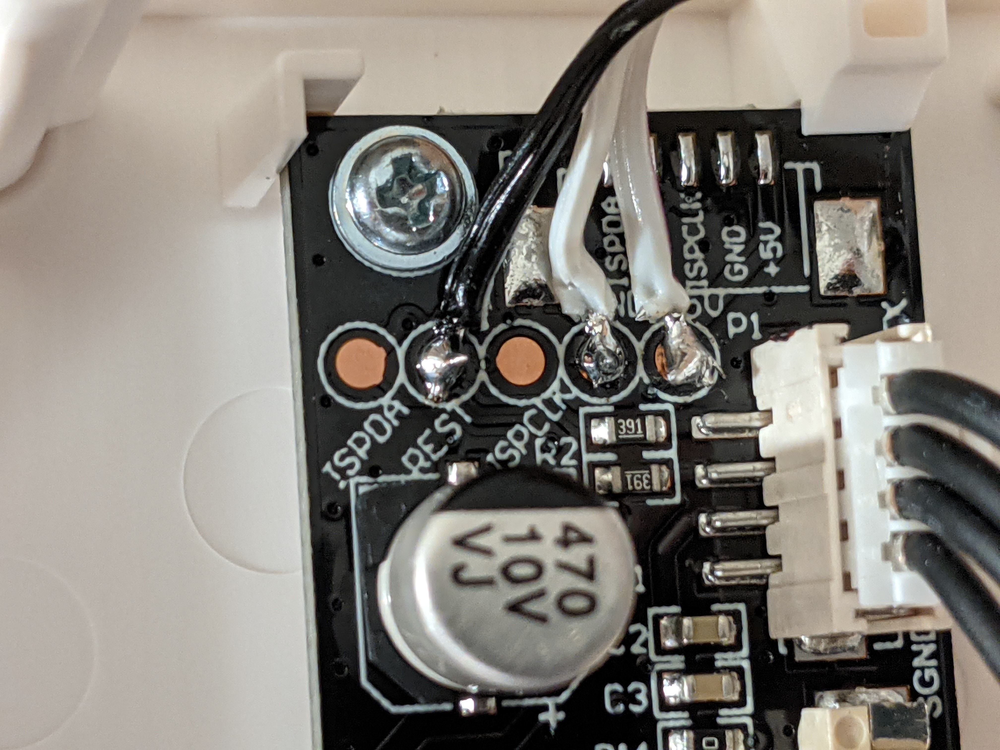
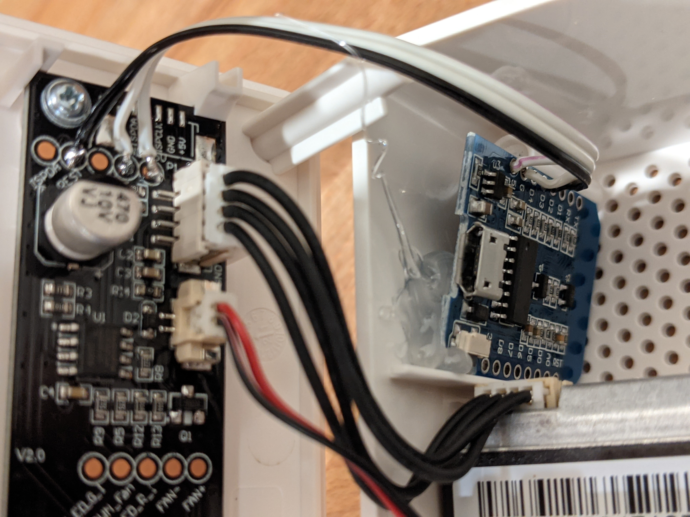
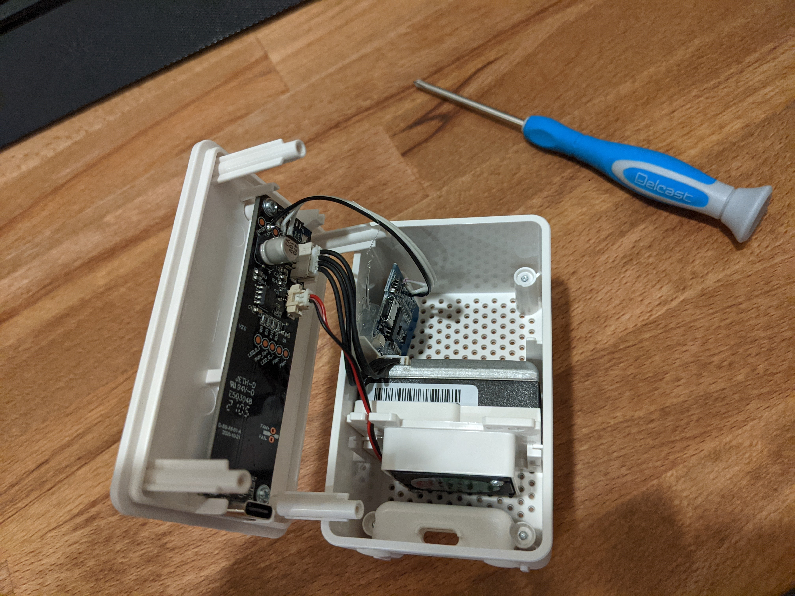
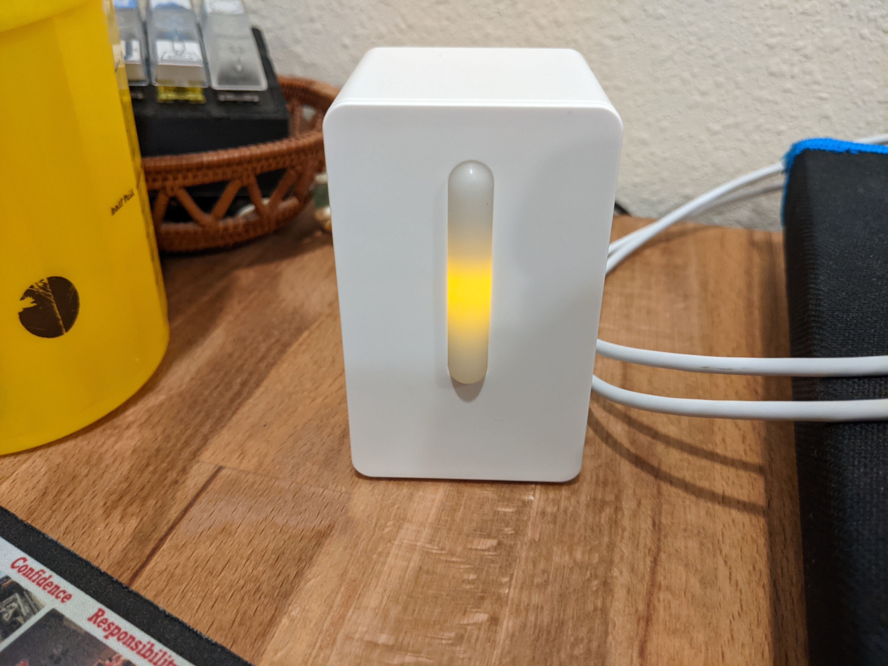

# Parts
- IKEA VINDRIKTNING
- ESP D1 Mini

# Add wiring information
Solder the 5V and GND pads in the IKEA sensor to the D1 Mini. The Rest pad is then wired to GPIO4 / D2 in the D1 mini for data.

# Assembly Information
The D1 mini can fit in the corner of the IKEA unit. I hot glued it in place in my sensors after soldering everything in place.

